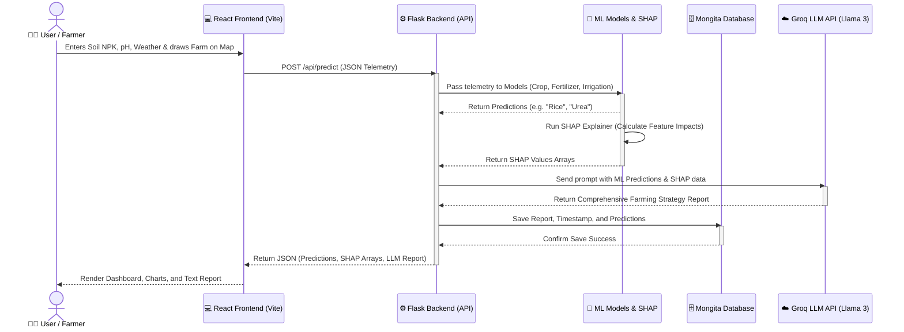

# 🏗️ Crop Prediction System Architecture

The following diagram and step-by-step guide explain exactly how data flows through the AgriSmart application, from the user's browser down to the Machine Learning models and back.

## 📊 Visual Architecture Diagram

---

## 📝 Step-by-Step Data Flow

### Step 1: User Input (The Frontend)
* The user opens the web application built in **React**.
* They interact with the **Leaflet Google Map** to draw their farm boundaries (calculating acreage) and enter their soil telemetry (Nitrogen, Phosphorus, Potassium, pH, etc.) into the form.
* When they click "Run Advisory", React bundles this data into a JSON package and sends an HTTP POST request to the **Flask Backend**.

### Step 2: Machine Learning & XAI (The Backend)
* The **Flask API** receives the JSON data.
* It feeds the data into the pre-trained `scikit-learn` and `xgboost` models (`.pkl` files) to get the predictions for Crop, Fertilizer, and Irrigation.
* Simultaneously, it runs **SHAP (Explainable AI)** to mathematically calculate *why* the models made those decisions (e.g., "Nitrogen had a +40% impact on choosing Rice").

### Step 3: Generative AI (The Cloud)
* Flask takes the raw ML predictions and the SHAP reasoning and injects them into a highly engineered text prompt.
* It sends this prompt over the internet to the **Groq API** (running the Llama-3 Large Language Model). 
* Groq reads the data and generates a multi-page, human-readable farming strategy in seconds.

### Step 4: Persistence (The Database)
* Before sending everything back to the user, Flask saves the entire session (Telemetry, Predictions, and the AI Report) locally into the **Mongita NoSQL Database**. This allows the user to view their history later on the Dashboard.

### Step 5: Visualization (The UI Render)
* Flask packages everything up and sends a final JSON response back to the React frontend.
* React updates its state and uses libraries like **Recharts** to draw dynamic graphs of the SHAP values, displaying the final ML predictions and the Groq LLM report beautifully on the screen for the farmer to read.
